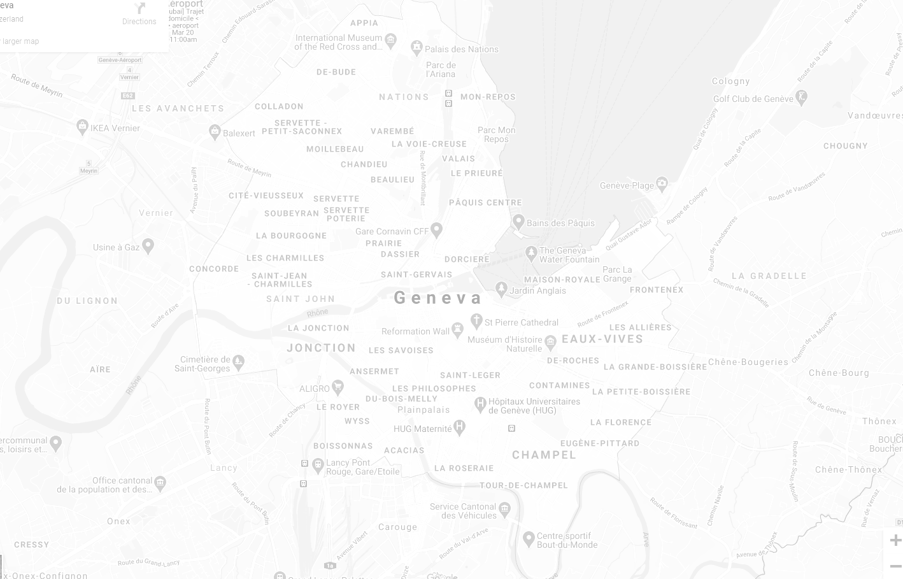

# vue-fullscreen-background-map
VueJS full screen background Google Map on a given location

## Install
```shell
npm install --save vue-fullscreen-background-map
```

## Usage
Just import the `FullScreenBackgroundMap` component where you want to see it !

```html
<template>
    <FullScreenBackgroundMap location="Genève" />
</template>

<script>
	import FullScreenBackgroundMap from 'vue-fullscreen-background-map'

	export default {
		components: {
			FullScreenBackgroundMap
		}
	}
</script>
```

### Props
**- location**
Location query for Google Maps (string)


## Screenshot

